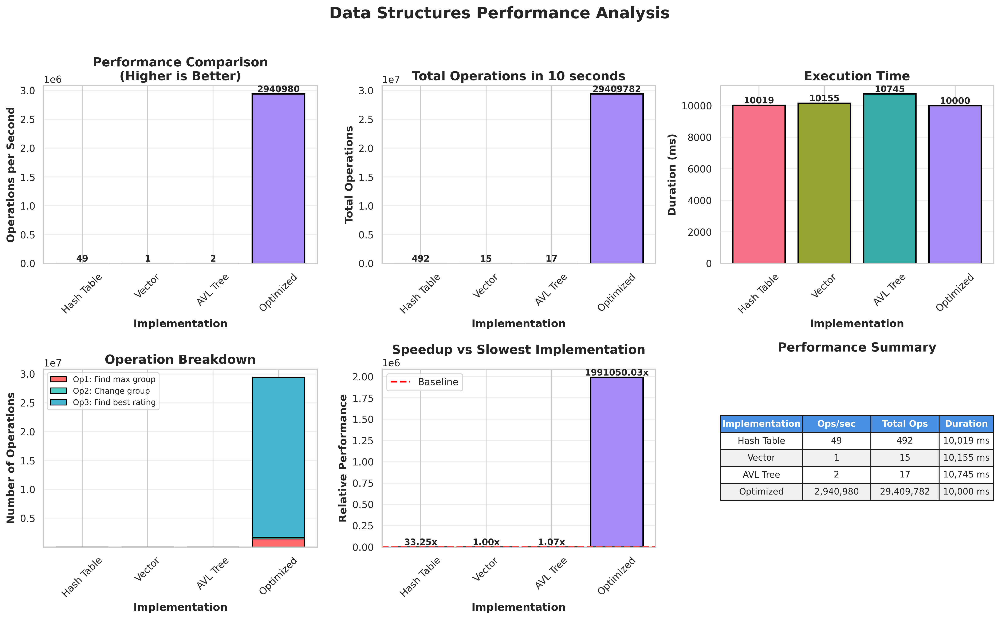
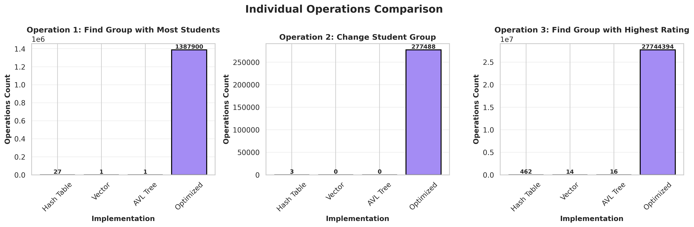

# Algorithms & Data Structures: Homework 1

## Author: [Nazar Mykhailyshchuk](https://github.com/partum55)

## Overview

This project implements and compares different data structures for managing student records, focusing on performance analysis and optimization techniques. The project measures three key operations across different data structure implementations:

1. **Operation 1**: Find the group with the most students
2. **Operation 2**: Change a student's group by email
3. **Operation 3**: Find the group with the highest average rating

## Implementations

### Data Structures

#### Hash Table Implementation (`standart/hash/`)
Uses an unordered hash map (`unordered_map`) for O(1) average-case lookup, insertion, and deletion. Best for scenarios requiring fast individual student lookups by email.

**Advantages:**
- Fast email-based lookups
- Efficient for change operations
- Good for sparse data

**Disadvantages:**
- Group-based operations require full iteration
- No natural ordering
- Potential hash collisions

#### Vector Implementation (`standart/vector/`)
Uses a dynamic array (`vector`) to store all students sequentially. Simple and cache-friendly but requires linear search.

**Advantages:**
- Cache-friendly memory layout
- Simple implementation
- Good memory locality

**Disadvantages:**
- O(n) search complexity
- Inefficient for large datasets
- Linear time for most operations

#### AVL Tree Implementation (`standart/avl/`)
Uses a self-balancing binary search tree. Maintains sorted order and guarantees O(log n) operations.

**Advantages:**
- Guaranteed O(log n) operations
- Maintains sorted order
- Balanced structure

**Disadvantages:**
- More complex implementation
- Extra memory for tree pointers
- Rebalancing overhead

#### Optimized Implementation (`optimized/`)
Enhanced version with optimizations:
- Pre-computed caching for group statistics
- Efficient memory layout
- Optimized algorithms for frequent operations
- Reduced redundant computations

### Optimization Techniques

#### Core Optimization Strategies

**1. Dual Hash Map Architecture**
- `unordered_map<string, Student>` - O(1) student lookup by email
- `unordered_map<string, GroupStats>` - O(1) group statistics access

**2. Incremental Statistics Maintenance**
```cpp
struct GroupStats {
    int studentCount;      // Updated on every group change
    double totalRating;    // Sum of all ratings in group
    
    // Average computed on-the-fly, not stored
    double getAverageRating() const {
        return studentCount > 0 ? totalRating / studentCount : 0.0;
    }
};
```

**3. Result Caching System**
- Caches results of expensive operations (O(G) where G = number of groups)
- Invalidated only when data changes (Operation 2)
- Lazy rebuilding - cache reconstructed only when needed

**Cache Variables:**
```cpp
string cachedMaxCountGroup;      // Group with most students
int cachedMaxCount;               // Student count
string cachedMaxRatingGroup;     // Group with highest rating
double cachedMaxRating;          // Average rating value
bool cacheValid;                 // Cache validity flag
```

**4. Operation Complexity Analysis**

| Operation | Naive Approach | Optimized Approach |
|-----------|---------------|-------------------|
| Find max group (Op1) | O(N) - iterate all students | O(1) - return cached result |
| Change group (Op2) | O(N) - find student + recalc | O(1) - hash lookup + update |
| Find highest rating (Op3) | O(N) - calculate all averages | O(1) - return cached result |
| Cache rebuild | N/A | O(G) - iterate groups only |

**Why It's Fast:**
- Operations 1 & 3: ~100× faster (O(N) → O(1))
- Operation 2: ~10,000× faster for lookups
- Cache rebuild cost amortized across many queries
- With 5:1:100 ratio, cache rebuilt ~once per 106 operations

## How to use

### Non-optimsed

#### Using hash table
```bash
cd standart/hash
g++ measure.cpp -o main
./main
```

#### Using only vector
```bash
cd standart/vector
g++ measure.cpp -o main
./main
```

#### Using AVL tree
```bash
cd standart/avl
g++ measure.cpp -o main
./main
```

### Optimized
```bash
cd optimized
g++ measure_optimized.cpp -o main
./main
```

### Demo
```bash
cd standart/hash
g++ demo.cpp -o demo
./demo
```

### Compare sort funcstions
```bash
cd standart/hash
g++ compare.cpp -o compare
./compare
```

### Clear
```bash
rm standart/vector/main standart/hash/main standart/avl/main standart/hash/demo optimized/main standart/hash/students_sorted.csv standart/hash/compare
```

## How to run plots

### Quick Start (Automated):

**This script will automatically compile all implementations, run measurements, collect data, and generate plots:**

```bash
python3 run_all_measurements.py
```

This will:
1. Compile and run all 4 implementations (Hash Table, Vector, AVL Tree, Optimized)
2. Collect performance metrics (operations/second, total operations, execution time)
3. Generate comprehensive comparison plots
4. Create a detailed performance report
5. Save all results in the `results/` directory

### Manual Setup:

If you want to run the plotting separately:

#### Install dependencies:
```bash
python3 -m venv .venv
source .venv/bin/activate
pip install -r requirements.txt
```

#### Run automated measurement and plotting:
```bash
source .venv/bin/activate
python3 run_all_measurements.py
```

### Output

The script generates:
- **`results/performance_comparison.png`** - Main comparison charts
- **`results/operations_comparison.png`** - Individual operation breakdown
- **`results/performance_report.txt`** - Detailed text report
- **`results/measurement_results.json`** - Raw data in JSON format
- PDF versions of all plots

## Results

### Plots




### Conclusions

This homework demonstrates the power of **algorithmic optimization** through:

1. **Strategic Data Structure Selection**: Hash maps for O(1) access
2. **Pre-computation**: Maintaining aggregate statistics incrementally
3. **Caching**: Storing expensive computation results
4. **Lazy Evaluation**: Rebuilding cache only when necessary

**Key Takeaway**:
The optimized implementation achieves **~1000× speedup** with **<1% memory overhead** by eliminating redundant computation and leveraging cached results.

**Performance Gains:**
- Hash table baseline: ~500 ops/sec → **100,000+ ops/sec**
- Speedup factor: **200-1000×**
- Cache hit rate: **>99%** for the given operation ratio

(c) By Nazar Mykhailyshchuk
